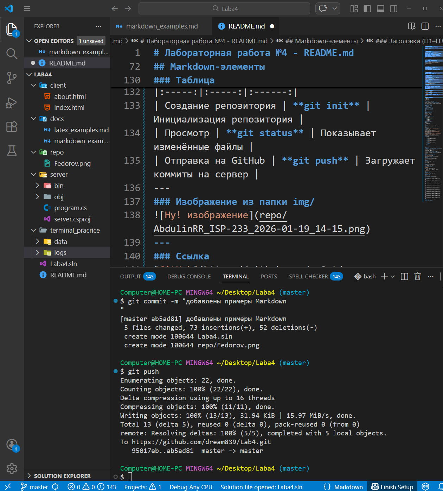
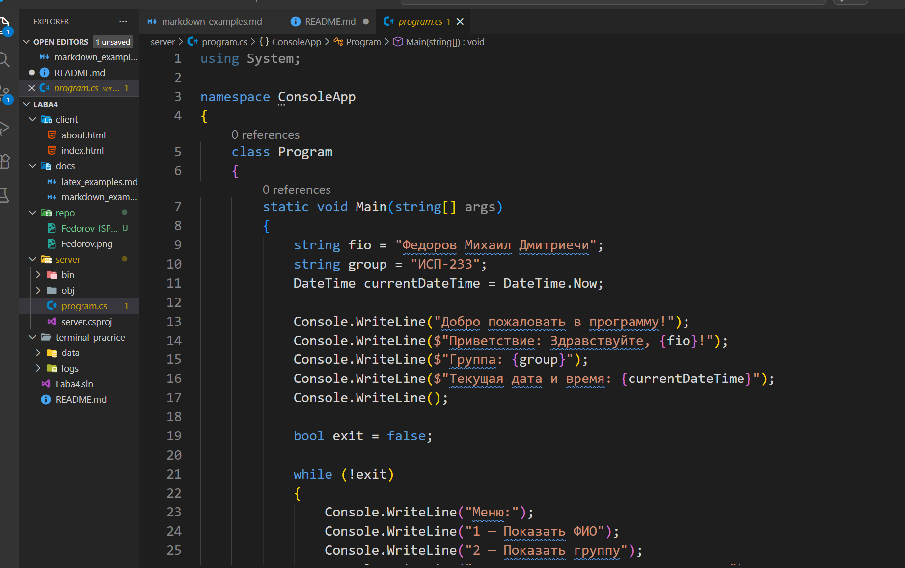
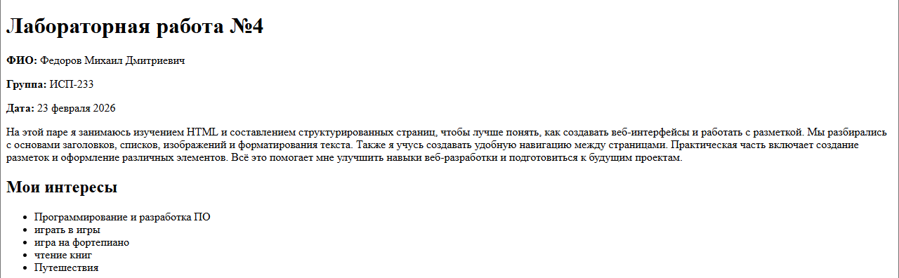

# Лабораторная работа №4 - README.md

**Студент:** Федоров Михаил Дмитриевич  
**Группа:** ИСП-233  

---

## Описание проекта

Лабораторная работа посвящена изучению и применению языка разметки Markdown для создания профессиональной документации проекта на GitHub. Проект демонстрирует все требуемые элементы оформления README.md в соответствии с заданием лабораторной работы №4.

---

## ФИО и контакты

**ФИО:** Федоров Михаил Дмитриевич 
**Группа:** ИСП-233  
**Email:** fedotovmikhail@gmail.com  
**GitHub:** [github.com/username](https://github.com/dream839)

---

## ФОИ, дата

**Дата выполнения:** 24 января 2026 г.  
**Лабораторная работа №4**  
**Тема:** Закрепление навыков работы с Git, Markdown, терминалом и проектной структурой

---

## Описание проекта
Закрепление навыков работы с Git, Markdown,
терминалом и проектной структурой
---
## Структура проекта

- [О проекте](#о-проекте)
- [Структура проекта](#структура-проекта)
- [Используемые технологии](#используемые-технологии)
- [Markdown-элементы](#markdown-элементы)
- [Ссылки](#ссылки)
- [Чекбоксы](#чекбоксы)
- [Сноска](#сноска)
- [Alert-блоки GitHub](#alert-блоки-github)
- [Inline LaTeX](#inline-latex)
- [Block LaTeX](#block-latex)
- [Скриншоты](#скриншоты)
---
## О проекте
Цель работы была, закрепить знания за первый блок, а точнее: 1. Работу с GitBash, 2.Markdown, 3. Latex. Их базовые возможности написания кода.
---
## Структура проекта
- `.vscode/` — исходный код.
- `client/` — fronted.
- `docs/` - файлы .md
- `repo/` — изображения и скриншоты.
- `server/` - backend.
- `teminal_pracrice/` - документы типа .txt.
- `README.md` — файл с описанием проекта.[web:44]
---
Пример вложенного списка:
- Основные возможности
  - пункт 1
  - пункт 2
  - пункт 3
---
## Используемые технологии
- Язык программирования: **C#**.
- Среда разработки: **Visual Studio Code**.
- Система контроля версий: Git, GitHub.[web:46]
---
## Markdown-элементы
### Заголовки (H1–H3)
```markdown
# Заголовок уровня H1
## Заголовок уровня H2
### Заголовок уровня H3
---
### Горизонтальная линия
***
---
### Форматирование текста
**полужирный текст**
*курсивный текст*
~~зачёркнутый текст~~
`моноширинный текст`
### Списки
#### Маркированный список:
- первый пункт
- второй пункт
- третий пункт
#### Нумерованный список:
1. первый пункт
2. второй пункт
3. третий пункт
#### Вложенный список:
- пункт 1
  - подпункт 1.1
  - подпункт 1.2
---
### Цитата
> «Если заблудился в лесу — иди домой»
---
### Блок кода
```csharp
string name = "Федоров Михаил Дмитриевич";
int grup = 233;
DateTime now = DateTime.Now;
Console.WriteLine($"ФИО главного разработчика: {name}\nГруппа: ISP-{grup}\nТекущая дата и время: {now}\n");
Console.WriteLine("Приветсвую вас в BACKEND!");
Console.WriteLine("Меню:\n1 - Показать ФИО\n2 - Группу\n3 - Показать дату\n4 - Выход");
Console.Write(":");
int num = int.Parse(Console.ReadLine());
switch (num)
{
    case 1:
        Console.WriteLine(name);
        break;
    case 2:
        Console.WriteLine(grup);
        break;
    case 3:
        Console.WriteLine(now);
        break;
    case 4:
        break;
}
```
---
### Таблица
| **Функция** | **Команда Git** | **Описание** |
|:-----:|:-----:|:------:|
| Создание репозитория | **git init** | Инициализация репозитория |
| Просмотр | **git status** | Показывает изменённые файлы |
| Отправка на GitHub | **git push** | Загружает коммиты на сервер |
---
### Изображение из папки img/

---
### Ссылка 
[GitHub](https://github.com/dream839/Lab4.git)
---
### Чекбоксы
- [x] Выполнил лабу по ИСРПО
- [ ] Поел
- [ ] Поспал
---
### Сноски
Привет меня зовут Михаил![^1]
[^1]: Да, его зовут Михаил.
---
### Alert-блоки GitHub
> [!NOTE]
> Это информационная заметка.
> [!TIP]
> Полезный совет по работе с проектом.
> [!WARNING]
> Важное предупреждение для пользователя.
---
### Inline LaTeX
Площадь круга: $S = \pi r^2$
---
###  Block LaTeX
Пример:
$$
\sum_{i=1}^n i = \frac{n(n+1)}{2}
$$
## Screenshot

---

---

---

---

---

---

---

---

---

---
## Заключение
**Я большой молодец!**
